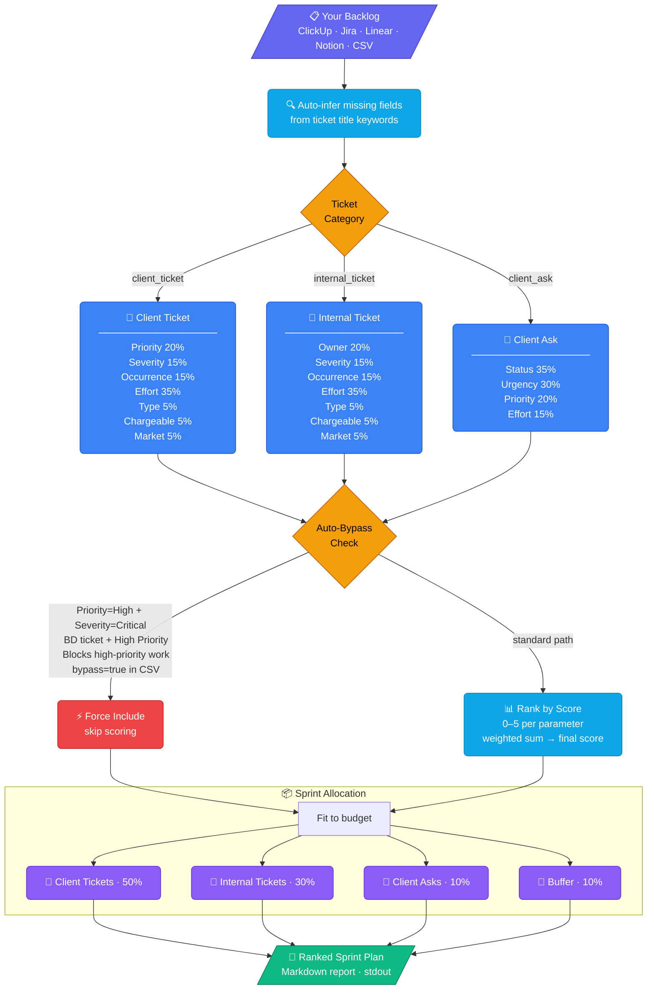
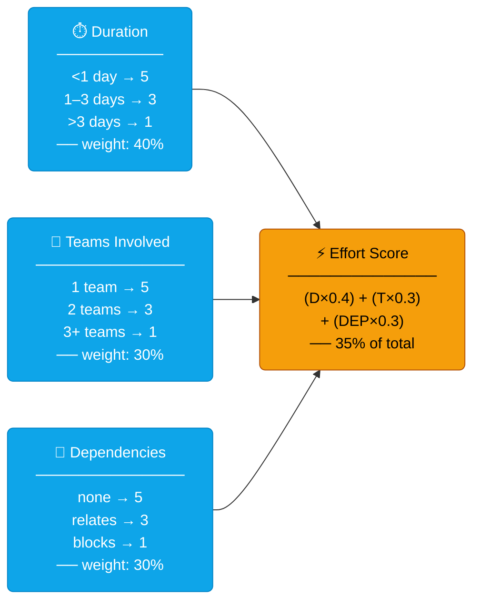
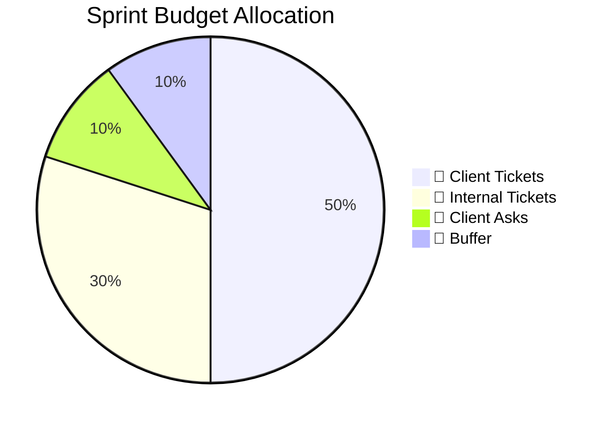
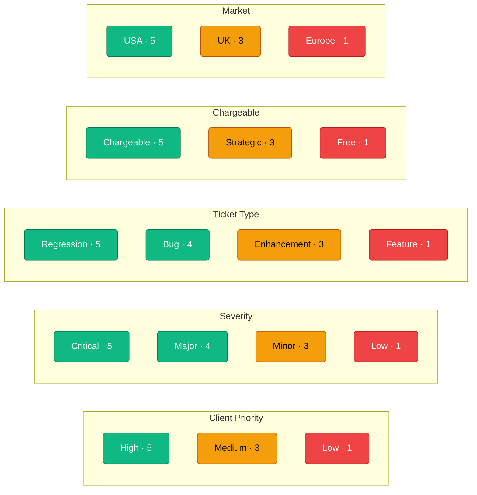

# Sprint Scorer

A tool-agnostic sprint prioritization engine for product managers. Export your backlog from **any** task tracking tool — ClickUp, Jira, Linear, Notion, or a spreadsheet — and get a data-driven, ranked sprint plan in seconds.

Built on a weighted scoring matrix covering client priority, ticket type, severity, effort, market, and more.

---

## How it works



---

## Effort score breakdown

Effort is a composite sub-score that feeds into each ticket's final score at **35% weight**.



> Lower effort (quick, single-team, no blockers) scores higher — the model favours high-impact, low-friction tickets.

---

## Sprint budget



---

## Scoring values at a glance



---

## Quickstart

```bash
# 1. Fill in your tickets
cp template.csv my_sprint.csv
# Edit my_sprint.csv with your backlog tickets

# 2. Configure your team
# Edit config.json — add team members, set bandwidth, adjust weights

# 3. Run
python score.py my_sprint.csv --sprint "Sprint 27"

# 4. Save as markdown
python score.py my_sprint.csv --sprint "Sprint 27" --output sprint27.md
```

---

## Example output

Scored sprint plan for a fictional e-commerce app (Shopify-style):

```
## Client Tickets (50%)

| # | ID     | Title                                              | Score  | Effort          |
|---|--------|----------------------------------------------------|--------|-----------------|
| 1 | SH-204 | Checkout page freezing on mobile Safari            |  4.32  | 5.0 (Low)       |
| 2 | SH-198 | Order confirmation emails not sending              |  4.18  | 4.2 (Low)       |
| 3 | SH-211 | Discount codes returning 422 on apply              |  4.05  | 3.0 (Medium)    |
| 4 | SH-187 | Product search returning wrong results for EU store|  3.91  | 3.6 (Medium)    |
| 5 | SH-220 | Inventory count not updating after bulk import     |  3.85  | 3.0 (Medium)    |

## Internal Tickets (30%)

| # | ID     | Title                                              | Score  | Effort          |
|---|--------|----------------------------------------------------|--------|-----------------|
| 1 | SH-301 | Improve error logging on payment webhooks          |  3.20  | 4.2 (Low)       |
| 2 | SH-289 | Refactor duplicate endpoints in orders API         |  3.02  | 4.2 (Low)       |
| 3 | SH-310 | Upgrade Node.js to v20 across backend services     |  2.41  | 3.6 (Medium)    |

## Auto-Included (Bypass)

| ID     | Title                                              | Reason                            |
|--------|----------------------------------------------------|-----------------------------------|
| SH-191 | Payments down — all transactions failing at checkout | Priority=High + Severity=Critical |
```

---

## CSV columns

| Column | Required | Description |
|--------|----------|-------------|
| `id` | Yes | Ticket ID from your tool |
| `title` | Yes | Ticket name/description |
| `category` | Yes | `client_ticket` / `internal_ticket` / `client_ask` |
| `client_priority` | Scored | `high` / `medium` / `low` |
| `ticket_type` | Scored | `regression` / `bug` / `enhancement` / `feature` |
| `severity` | Scored | `critical` / `major` / `minor` / `low` |
| `occurrence` | Scored | `frequent` / `multiple` / `once` |
| `chargeable` | Scored | `chargeable` / `strategic` / `free` |
| `duration` | Scored | `<1day` / `1-3days` / `>3days` |
| `teams_involved` | Scored | `1` / `2` / `3+` — or leave blank if using `assignee_ids` |
| `assignee_ids` | Optional | Pipe-separated assignee IDs (e.g. `87653460\|87653461`). Mapped to teams via `config.json` |
| `dependencies` | Scored | `none` / `relates` / `blocks` |
| `market` | Scored | `usa` / `uk` / `europe` |
| `ticket_owner` | Internal only | `bd` / `tech` / `qa` / `marketing` / `design` |
| `due_date_urgency` | Client ask only | `critical` / `moderate` / `low` |
| `ticket_status` | Client ask only | `ready` / `customer_review` / `to_do_design` |
| `progress` | Optional | `not_started` / `in_progress` / `done` |
| `bypass` | Optional | `true` to skip scoring and auto-include |
| `bypass_reason` | Optional | Reason for bypass |

> **Blank fields are fine.** The scorer infers missing values from the ticket title using keyword heuristics. The more fields you fill in, the more accurate the score.

---

## config.json

```json
{
  "bandwidth": {
    "backend": 170,
    "frontend": 185,
    "ai": 115,
    "qa": 175
  },
  "team_map": {
    "87653460": "backend",
    "87653461": "frontend"
  },
  "allocation": {
    "client_ticket": 0.50,
    "internal_ticket": 0.30,
    "client_ask": 0.10,
    "buffer": 0.10
  }
}
```

**`team_map`**: Map assignee IDs from your tool to team names. Used to calculate `teams_involved` automatically from `assignee_ids`. Get IDs from your tool's API or export.

---

## Exporting from your tool

| Tool | How to export |
|------|--------------|
| **ClickUp** | List view → Export → CSV |
| **Jira** | Backlog → Export Issues → CSV |
| **Linear** | Issues → Export → CSV |
| **Notion** | Database → Export → CSV |
| **Spreadsheet** | Save as CSV |

After export, map your tool's column names to the template columns. Unscored fields are inferred automatically.

---

## Requirements

Python 3.8+. No external dependencies — standard library only.
